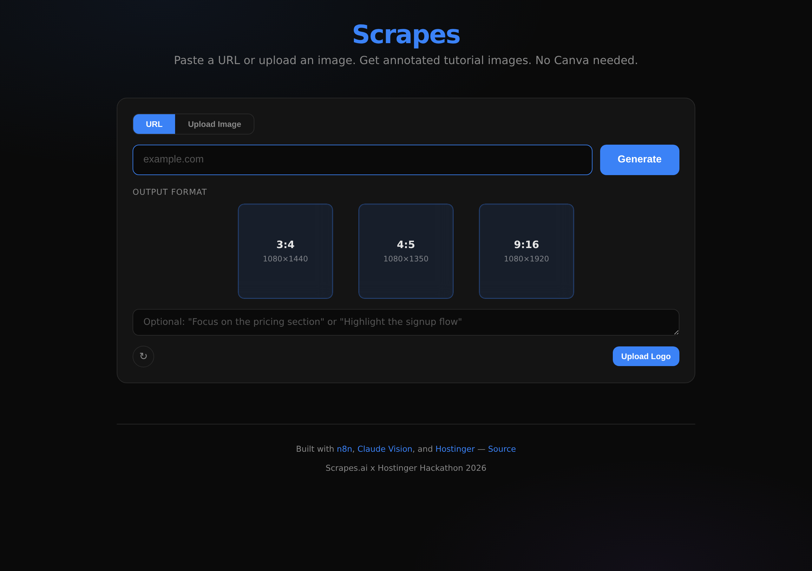
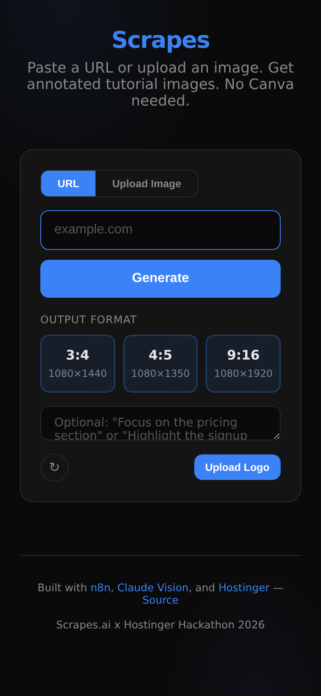

# Scrapes

### Paste a URL. Get tutorial-ready carousel images. No design skills needed.

> **"What if turning any webpage into a polished Instagram carousel took 15 seconds instead of 45 minutes in Canva?"**

Built for the **Scrapes.ai x Hostinger Hackathon 2026** · Live at **[scrapes.felaniam.cloud](https://scrapes.felaniam.cloud)**

---

## The Problem

Every day, creators, educators, and marketers see web content they want to share — a tool launch, a tutorial, a landing page breakdown. But turning that into engaging visual content means:

- Screenshotting manually and cropping sections
- Opening Canva/Figma and placing elements one by one
- Writing callouts, drawing arrows, picking colors
- Resizing everything for each platform
- Repeating the entire process per format

**A 5-minute insight becomes a 45-minute design task.** Most people just don't bother.

---

## The Solution

**Scrapes** eliminates the entire design step. Give it a URL, pick your formats, and it delivers annotated carousel images — with intelligent highlights, arrows, callouts, and a cohesive color scheme — rendered and ready to post.

No templates. No drag-and-drop. No design decisions. Claude Vision *sees* the page, *understands* what matters, and *builds* the carousel for you.

```
URL  →  Viewport Screenshot  →  AI Analysis  →  Annotated Carousel  →  Download & Post
```

---

## Features

- **3-Type, 5-Slide System** — Opener → Scene → Scene → Scene → Closer. Every carousel tells a story arc in exactly 5 slides
- **Opener with Bullets** — Title card combines headline + 3 key takeaways, replacing the old separate insight slide
- **3 Vertical Formats** — Portrait (3:4), Social (4:5), Story (9:16) — pick one or all
- **One-Pass Intelligence** — Claude Vision analyzes once, renders to any ratio. 1 format or 3 = same ~$0.03 API cost
- **Fixed Viewport Capture** — Urlbox captures above-the-fold at 1080x1350 (retina 2x) for a bounded, predictable canvas
- **Tight Crop Regions** — Scene slides divide the viewport into 3 dense, content-filled bands
- **Parallel Format Rendering** — Each format renders independently with its own viewport-matched screenshot
- **User-Guided Focus** — Tell it what to highlight: *"Focus on the pricing table"* or *"Annotate the signup flow"*
- **Auto Color Extraction** — Pulls the page's brand palette for cohesive, on-brand annotations
- **Smart Image Compression** — Images auto-compress for Claude's 5MB limit when needed, full-res preserved for rendering
- **Image Upload Support** — Don't have a URL? Drop in a screenshot directly
- **Batch Download** — One click to grab every generated image
- **Glassmorphism UI** — Dark, minimal interface with frosted glass effects and Material Design 3 color system

---

## Demo

| Step | What Happens |
|------|-------------|
| **1. Paste** | Drop any URL into the input field |
| **2. Select** | Check the formats you want (3:4, 4:5, 9:16) |
| **3. Guide** *(optional)* | Add a prompt to steer what Claude focuses on |
| **4. Generate** | Hit go — results appear in ~15 seconds |
| **5. Browse** | Scroll through results in a horizontal carousel layout |

**Try it live:** [scrapes.felaniam.cloud](https://scrapes.felaniam.cloud)

<p align="center">
  
</p>

<details>
<summary>Mobile view</summary>
<p align="center">
  
</p>
</details>

---

## How It Works

Scrapes separates **annotation** (the expensive, creative AI step) from **rendering** (the mechanical compositing step):

```
┌──────────┐     ┌────────────────┐     ┌──────────────────┐     ┌────────────────┐
│  Browser  │────▶│  Express Server │────▶│  Claude Vision    │────▶│  n8n Pipeline   │
│           │     │  (proxy + API)  │     │  (analyze once)   │     │  (render N fmt) │
└──────────┘     └────────────────┘     └──────────────────┘     └────────────────┘
                        │                        │                        │
                        ▼                        ▼                        ▼
                    Urlbox                 Structured JSON           Browserless
              (viewport capture +         annotation plan          (HTML → PNG)
               markdown extract)
```

**The 3-type slide system (always exactly 5 slides):**

| Slide | Type | Purpose |
|-------|------|---------|
| 1 | **Opener** | Title + badge + 3 bullet takeaways. Sets context AND delivers key insights in one card |
| 2–4 | **Scene** | Screenshot crop + annotations (highlights, arrows, callouts). The workhorse slides |
| 5 | **Closer** | Contextual ending — "Try it" for tools, step recap for tutorials, TL;DR for articles |

Claude analyzes a fixed 1080x1350 viewport (above-the-fold) and returns all annotations in **percentage-based coordinates**, so the same plan scales naturally to 3:4, 4:5, 9:16 — or any future ratio — without re-running the AI. The bounded canvas makes coordinate placement deterministic.

---

## Tech Stack

| Technology | Role | Why This |
|-----------|------|----------|
| **Node.js + Express** | Server & API proxy | Minimal, fast, handles the single `/api/annotate` endpoint |
| **Claude Sonnet 4.6** | Vision analysis + annotation planning | Best-in-class vision understanding — sees UI elements, not just pixels |
| **Urlbox** | Page capture | HMAC-signed render links, fixed 1080x1350 viewport at retina 2x, ad/cookie blocking, markdown extraction |
| **sharp** | Image processing | Downscales retina screenshots for Claude's limits, compresses uploads |
| **Browserless** | HTML → PNG rendering | Self-hosted headless Chrome — renders SVG overlays onto screenshots at exact pixel dimensions |
| **n8n** | Workflow orchestration | Visual pipeline that connects screenshot → analysis → rendering |
| **Coolify** | Deployment platform | One-click Docker deploys on Hostinger VPS — the entire stack self-hosted |

**Dependencies:** `express`, `@anthropic-ai/sdk`, `sharp`

---

## Getting Started

### Prerequisites

- Node.js 18+
- Running [n8n](https://n8n.io) instance with the Scrapes render workflow
- [Browserless](https://browserless.io) instance (self-hosted or cloud)
- [Urlbox](https://urlbox.com) API credentials
- [Anthropic](https://anthropic.com) API key

### Local Setup

```bash
# Clone
git clone https://github.com/txmyer-dev/scrapes.git
cd scrapes

# Install
npm install

# Configure
export ANTHROPIC_API_KEY=sk-ant-...
export URLBOX_API_KEY=your-urlbox-api-key
export URLBOX_SECRET_KEY=your-urlbox-secret-key
export N8N_RENDER_WEBHOOK=https://your-n8n/webhook/scrapes-render

# Run
npm start
```

App runs on `http://localhost:3100`

### Docker

```bash
docker build -t scrapes .
docker run -p 3100:3100 \
  -e ANTHROPIC_API_KEY=sk-ant-... \
  -e URLBOX_API_KEY=... \
  -e URLBOX_SECRET_KEY=... \
  -e N8N_RENDER_WEBHOOK=https://your-n8n/webhook/scrapes-render \
  scrapes
```

---

## Known Limitations

- **Above-the-fold only.** Screenshots capture a fixed 1080x1350 viewport (what a visitor sees on first load). Content below the fold is not included in scene slides, though full-page markdown is still extracted for Claude's text context. This tradeoff gives reliable, deterministic annotation placement at the cost of deep-page content coverage.

---

## Architecture

```
scrapes/
├── server.js           # Express server, Claude Vision, HTML template builders, image compression
├── public/
│   └── index.html      # Single-page frontend (Tailwind + Material Design 3 glassmorphism UI)
├── Dockerfile          # Alpine Node 22 container
├── docker-compose.yaml # Full stack compose
└── deploy.sh           # Deployment script
```

**Cost per generation:** ~$0.03 (one Claude Sonnet vision call) + negligible compute for rendering. Generating 3 formats from one URL costs the same as generating 1.

---

## License

MIT

---

<p align="center">
  Built with frustration toward Canva and respect for Claude's vision capabilities.<br/>
  <strong>Scrapes.ai x Hostinger Hackathon 2026</strong>
</p>
